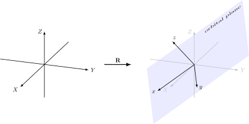
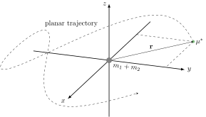
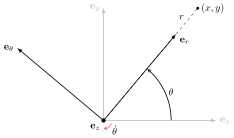

.. default-role:: math

A Change of Perspective
***********************

:Author: M. Werner

.. admonition:: Plan of Action

    The solution of the *general* 2-body problem is developed several
    different ways utilizing the now known special
    :ref:`properties<Insights and Conserved Quantities>` admitted by the system.

Reorienting the coordinate system
=================================

Knowing that the motion **must** be 2-dimensional, we can choose a more
convenient reference frame using a coordinate rotation. Let this rotation
be denoted `\mathbf{R} \in \mathrm{SO}(3)` such that

.. math::
    \begin{pmatrix}x \\ y \\ z\end{pmatrix} = \mathbf{R} \begin{pmatrix}X \\ Y \\ Z\end{pmatrix}.

Although they look different, `(x, y, z)` and `(X, Y, Z)` both represent the **same** object.

It's very convenient to utilize the conservation of angular momentum and
the Laplace-Runge-Lenz (LRL) vector to define the precise action of
`\mathbf{R}` on the two coordinate systems.
**We choose to orient the** `z` **axis in the direction of the angular momentum**
**and the** `x` **axis in the direction of the LRL vector.**

    The result of applying the rotation matrix `\mathbf{R}` to the original
    coordinates `(X, Y, Z)` is to rotate its coordinate directions. These
    new coordinates are labelled `(x, y, z)`; the motion of the two particles
    occurs entirely in the `xy` plane, called the **orbital plane.**

This rotation is **not** time-dependent --- that is, `\mathbf{R}` is
a constant matrix representing a rotation between the two coordinate systems.

The standard form of the equations of motion is consequently *unchanged*.

Switching into polar coordinates
================================

By choosing this new coordinate system, we have reduced the problem to
determining just 2 unknown quantities --- the parameterizations of polar coordinates,

.. math::
    x &= r \cos\theta \\
    y &= r \sin\theta \\
    z &= 0,
    :label: polarCoordinates

where `r = |\mathbf{r}|` as usual and `\theta` is the angle made
between the reduced mass particle and the `x` axis.

    A "trajectory" in the new coordinates utilizing polar
    coordinates `(r,\theta)`. Note that this trajectory is actually
    **impossible** since there is a change in the sign of angular momentum, a
    constant of motion.

.. Important:: The relative motion of the two bodies (`\mathbf{r}`)
    *in the orbital plane* is fully determined by the set of polar coordinates
    `(r, \theta)`. **The 2-body problem has been reduced from determining all 6 variables to only 2.**

Developing new equations of motion
----------------------------------
.. admonition:: Recall

    The time rates of change of a vector `\mathbf{x} \in \mathbb{R}^3` that's
    expressed in a coordinate system `\mathcal{B}` rotating with
    angular velocity `\mathbf{\Omega} \in \mathbb{R}^3` relative to another coordinate system
    `\mathcal{A}` follow

    .. math::
        \sideset{}{^{\!\mathcal{A}}}{\left(\frac{d\mathbf{x}}{dt}\right)} = \sideset{}{^{\!\mathcal{B}}}{\left(\frac{d\mathbf{x}}{dt}\right)} + \ \mathbf{\Omega} \times \mathbf{x}^\mathcal{B}

With polar coordinates being used to describe position, it's extremely
convenient to change our reference frame again by switching into the (noninertial) cylindrical coordinate system.

    The cylindrical reference frame `\{\mathbf{e}_r,\mathbf{e}_\theta, \mathbf{e}_z\}`
    rotates with respect to the inertial reference frame `\{\mathbf{e}_x,\mathbf{e}_y, \mathbf{e}_z\}`
    at an angular velocity `\dot{\theta}\,\mathbf{e}_z`.
    Note that at the instant shown, `\dot{\theta} < 0`, but this is actually **impossible**.

This transformation is especially useful as the expression for the relative position simplifies dramatically to

.. math::
    \mathbf{r} = r\,\mathbf{e}_r.

From this, we need to calculate the **inertial** velocity and acceleration before continuing.
These expressions are given by

.. math::
    \dot{\mathbf{r}} &= \dot{r}\,\mathbf{e}_r + r \dot{\theta}\,\mathbf{e}_\theta \\
    \ddot{\mathbf{r}} &= (\ddot{r} - r\dot{\theta}^2)\mathbf{e}_r + (r\ddot{\theta} + 2\dot{r}\dot{\theta})\mathbf{e}_\theta.

Simply inserting these back into the standard form of the 2-body problem
gives us a new set of differential equations in terms of `r` and `\theta`.

.. math::
    \ddot{r} - r\dot{\theta}^2 &= -\frac{\mu}{r^2} \\
    r\ddot{\theta} + 2\dot{r}\dot{\theta} &= 0
    :label: polarEOM

Rewriting the conserved quantities
----------------------------------

Angular momentum
~~~~~~~~~~~~~~~~
The angular momentum `\mathbf{h}` expressed in polar coordinates is

.. math::
  \mathbf{h} &= \mathbf{r} \times \dot{\mathbf{r}} \\
  &= \left(r\,\mathbf{e}_r\right) \times \left(\dot{r}\,\mathbf{e}_r + r \dot{\theta}\,\mathbf{e}_\theta\right) \\
  &= r\dot{r} (\mathbf{e}_r \times \mathbf{e}_r) + r^2\dot{\theta} (\mathbf{e}_r \times \mathbf{e}_\theta) \\
  &= r^2\dot{\theta}\,\mathbf{e}_z.

Since `\mathbf{h} = h \mathbf{e}_z` too by construction of `\mathbf{R}` (where `h = |\mathbf{h}|` is a constant of motion), the conservation of angular momentum provides

.. math::
  \boxed{r^2\dot{\theta} = h.}
  :label: AMconservation

This simple equation proves to be **very** useful, and we're even able to get
some information out of it (since we know that `h \geqslant 0` and `r > 0`).

.. important::
    1. **The trajectory always goes in the counterclockwise direction!** (`\dot{\theta} \geqslant 0`)

    2. A **collision** will occur if there's no angular momentum.

        - This happens since `\ddot{r} < 0`, which eventually drives `r \to 0` in **finite time.**

LRL vector
~~~~~~~~~~~~~~~~~~~~~~~~~
The LRL vector `\mathbf{A}` expressed in polar
coordinates is

.. math::
    \mathbf{A} &= \dot{\mathbf{r}} \times \mathbf{h} - \frac{\mu}{r}\mathbf{r} \\
    &= (\dot{r}\,\mathbf{e}_r + r\dot{\theta}\,\mathbf{e}_\theta) \times (r^2\dot{\theta}\,\mathbf{e}_z) - \frac{\mu}{r} (r \,\mathbf{e}_r) \\
    &= r^2\dot{r}\dot{\theta}(\mathbf{e}_r \times \mathbf{e}_z) + r^3\dot{\theta}^2(\mathbf{e}_\theta \times \mathbf{e}_z) - \mu\,\mathbf{e}_r \\
    &= r^2\dot{r}\dot{\theta}(-\mathbf{e}_\theta) + r^3\dot{\theta}^2(\mathbf{e}_r) - \mu\,\mathbf{e}_r \\
    &= (r^3\dot{\theta}^2 - \mu)\mathbf{e}_r - r^2\dot{r}\dot{\theta}\,\mathbf{e}_\theta \\
    &= A \underbrace{(\cos\theta\,\mathbf{e}_r - \sin\theta\,\mathbf{e}_\theta)}_{\mathbf{e}_x}.

(The last equality holds by construction of `\mathbf{R}`.)

To summarize, we get two scalar equations from the invariance of the LRL vector.

.. math::
  :label: LaplaceRungeLenz

  r^2\dot{r}\dot{\theta} &= A\sin\theta \\
  r^3\dot{\theta}^2 - \mu &= A\cos\theta

.. important::
    **Combined with angular momentum, we can get expressions of** `r(\theta)` **and** `\dot{r}(\theta)` **very quickly!**

Energy
~~~~~~
The energy `E` expressed in polar coordinates is

.. math::
    :label: eq:energy

    E = \frac{1}{2}\underbrace{(\dot{r}^2 + r^2\dot{\theta}^2)}_{v^2 = \dot{\mathbf{r}} \cdot \dot{\mathbf{r}}} - \frac{\mu}{r}.

.. important::
    - Paired with angular momentum, this expression "integrates" the
      `\ddot{r}` equation of motion with integration constant
      `2E`.
    - Similarly, this relation provides another expression for
      `\dot{\theta}` in addition to that from the conservation of
      angular momentum using the knowledge that `\dot{\theta} > 0`
      for interesting motion.

.. footer:: This document was generated on |today|.