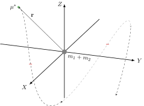

.. default-role:: math

.. sectnum::
    :start: 2

=================================
Insights and Conserved Quantities
=================================

:Author: M. Werner

.. admonition:: Plan of Action

    The general 2-body problem may be simplified greatly by utilizing
    several special properties admitted by the system. These properties
    *will* enable a full solution of the general problem to be determined
    analytically.

The Newtonian, Lagrangian, and Hamiltonian formalisms all provide the same
system of equations for the motion of two particles under
mutual Newtonian gravitational attraction with respect to the origin of an inertial
coordinate system.

.. math::
    :label: general2bp

    \ddot{\mathbf{r}}_1 &= -\frac{G m_2}{|\mathbf{r}_1 - \mathbf{r}_2|^3}(\mathbf{r}_1 - \mathbf{r}_2) \\
    \ddot{\mathbf{r}}_2 &= -\frac{G m_1}{|\mathbf{r}_2 - \mathbf{r}_1|^3}(\mathbf{r}_2 - \mathbf{r}_1)

Amazingly, this general system :eq:`general2bp` has a closed-form solution.
Obtaining this solution, however, is made significantly easier once several properties are known.

Relative Form
=============
To reduce the complexity of :eq:`general2bp` (as we will see), we can
define the **relative** distance between each body as

.. math::
    :label: relative

    \mathbf{r} = \mathbf{r}_2 - \mathbf{r}_1.

The equations of motion may be calculated directly since

.. math::
    :label: eq:relativeEOM

    \ddot{\mathbf{r}} &= \ddot{\mathbf{r}}_2 - \ddot{\mathbf{r}}_1 \\
    &= -\frac{G(m_1 + m_2)}{r^3}\mathbf{r},

where `r = |\mathbf{r}|` is the distance between the two particles.

.. Important:: Doing this is beneficial because it exploits a symmetry in
    the full system of equations, essentially **halving** the number of
    equations to be solved in order to obtain *any* information.

Conserved Quantities
====================
Linear Momentum
---------------
.. admonition:: Recall

    For any `\mathbf{x}_1, \mathbf{x}_2 \in \mathbb{R}^3`, the center of mass for a
    system of two particles with respect to an inertial coordinate system is

    .. math::
        \mathbf{x}_{cm} \equiv \frac{m_1 \mathbf{x}_1 + m_2 \mathbf{x}_2}{m_1 + m_2},

    where `m_1` and `m_2` are the masses of each body located
    (instantaneously) at `\mathbf{x}_1` and `\mathbf{x}_2`.

The two bodies are **isolated** --- that is, the center of mass satisfies

.. math:: \mathbf{r}_{cm}(t) = \mathbf{r}_{cm}(0) + \dot{\mathbf{r}}_{cm}(0) t,

since there is no external forcing to the system.
As such, the center of mass moves in a straight line (or not at all) in
accordance with Newton's 1\ :sup:`st` law. Further, we have **explicitly**
that

.. math::
    :label: positionsFromCenterOfMass

    \mathbf{r}_1 = \mathbf{r}_{cm} - \frac{m_2}{m_1 + m_2}\mathbf{r} \qquad \text{and} \qquad \mathbf{r}_2 = \mathbf{r}_{cm} + \frac{m_1}{m_1 + m_2}\mathbf{r}.

You can validate this for yourself!

.. Important::
    :eq:`relative` provides **direct**
    information of both bodies (relative to each other) through
    :eq:`eq:relativeEOM` *and* enables the inertial positions of both bodies to
    be *calculated* from :eq:`positionsFromCenterOfMass` rather than directly
    solved from :eq:`general2bp`.

    This solidifies the idea that only half of the amount of equations
    have to be solved with :eq:`eq:relativeEOM`, but now *all* information about
    *both* bodies is known.

Angular Momentum
----------------
.. admonition:: Recall

    #.  For any `\mathbf{x} \in \mathbb{R}^3`, the cross-product of `\mathbf{x}`
        with itself vanishes.

        .. math::
            \mathbf{x} \times \mathbf{x} \equiv \mathbf{0}

    #.  For any `\mathbf{x},\mathbf{y} \in \mathbb{R}^3`, the cross-product is
        anticommutative.

        .. math::
            \mathbf{x} \times \mathbf{y} = -(\mathbf{y} \times \mathbf{x})

Rewriting the Kepler problem in a convenient form,

.. math::
    \ddot{\mathbf{r}} + \frac{G(m_1 + m_2)}{r^3}\mathbf{r} = \mathbf{0},

lets us immediately show

.. math::
    \mathbf{0} &= \left(\ddot{\mathbf{r}} + \frac{G(m_1 + m_2)}{r^3}\mathbf{r}\right) \!\times \mathbf{r} \\
    &= \ddot{\mathbf{r}} \times \mathbf{r} + \left(\frac{G(m_1 + m_2)}{r^3}\mathbf{r}\right) \!\times \mathbf{r} \\
    &= \ddot{\mathbf{r}} \times \mathbf{r} + \frac{G(m_1 + m_2)}{r^3}\left(\mathbf{r} \times \mathbf{r}\right) \\
    &= \ddot{\mathbf{r}} \times \mathbf{r} \\
    &= \ddot{\mathbf{r}} \times \mathbf{r} + \dot{\mathbf{r}} \times \dot{\mathbf{r}} \\
    &= \frac{d}{dt}\underbrace{(\dot{\mathbf{r}} \times \mathbf{r})}_{-\mathbf{h}}.

We conclude that the (specific) angular momentum `\mathbf{h}` is conserved under the dynamics of the 2-body problem.

.. math::
    \mathbf{h} = \mathbf{r} \times \dot{\mathbf{r}} \equiv \mathrm{const.}

.. Important::
    **The motion of the two bodies must be planar!**

The Laplace-Runge-Lenz Vector
-----------------------------
.. admonition:: Recall

    For any `\mathbf{x},\mathbf{y},\mathbf{z} \in \mathbb{R}^3`, the vector triple product
    satisfies

    .. math::
        \mathbf{x} \times (\mathbf{y} \times \mathbf{z}) = (\mathbf{x} \cdot \mathbf{z}) \mathbf{y} - (\mathbf{x} \cdot \mathbf{y}) \mathbf{z}.

Knowing that the angular momentum `\mathbf{h}` is conserved, we can do the following calculation.

.. math::
    \frac{d}{dt}(\dot{\mathbf{r}} \times  \mathbf{h}) &= \ddot{\mathbf{r}} \times \mathbf{h} \\
    &= \left(-\frac{G(m_1 + m_2)}{r^3} \mathbf{r}\right) \times (\mathbf{r} \times \dot{\mathbf{r}}) \\
    &= -\frac{G(m_1 + m_2)}{r^3} \big(\mathbf{r} \times (\mathbf{r} \times \dot{\mathbf{r}})\big) \\
    &= -\frac{G(m_1 + m_2)}{r^3} \big((\mathbf{r} \cdot \dot{\mathbf{r}})\mathbf{r} - (\mathbf{r} \cdot \mathbf{r})\dot{\mathbf{r}}\big) \\
    &= -\frac{G(m_1 + m_2)}{r^3} \big(r\dot{r} \mathbf{r} - r^2 \dot{\mathbf{r}}\big) && \quad \left(\mathbf{r} \cdot \dot{\mathbf{r}} = \frac{1}{2}\frac{d}{dt}(\mathbf{r} \cdot \mathbf{r})\right)\\
    &= -G(m_1 + m_2) \left(\frac{\dot{r}}{r^2} \mathbf{r} - \frac{1}{r}\dot{\mathbf{r}}\right) \\
    &= G(m_1 + m_2) \left(\frac{r \dot{\mathbf{r}} - \dot{r} \mathbf{r}}{r^2}\right) \\
    &= G(m_1 + m_2) \frac{d}{dt}\left(\frac{\mathbf{r}}{r}\right) \\
    &= \frac{d}{dt}\left(\frac{G(m_1 + m_2)}{r}\mathbf{r}\right).

Finally, we can combine the first and last expressions since the derivative is a linear operation.
This provides the conserved quantity `\mathbf{A}`, the so-called
Laplace-Runge-Lenz vector\ :sup:`[`\ [2]_:sup:`]`.

.. math::
    \mathbf{A} = \dot{\mathbf{r}} \times \mathbf{h} - \frac{G(m_1 + m_2)}{r}\mathbf{r} \equiv \mathrm{const.}

.. Important::
    **There is a direction in the plane of motion of the two bodies that stays constant as a function of relative position and velocity!**

Energy
------
Manipulating the relative form of the equations of motion provides

.. math::
    \mathbf{0} &= \left(\ddot{\mathbf{r}} + \frac{G(m_1 + m_2)}{r^3}\mathbf{r}\right) \cdot \dot{\mathbf{r}} \\
    &= \ddot{\mathbf{r}} \cdot \dot{\mathbf{r}} + \left(\frac{G(m_1 + m_2)}{r^3}\mathbf{r}\right) \cdot \dot{\mathbf{r}} \\
    &= \frac{1}{2}\frac{d}{dt}(\dot{\mathbf{r}} \cdot \dot{\mathbf{r}}) + \frac{G(m_1 + m_2)}{r^3}(\mathbf{r} \cdot \dot{\mathbf{r}}) \\
    &= \frac{1}{2}\frac{d}{dt}(\dot{\mathbf{r}} \cdot \dot{\mathbf{r}}) + \frac{G(m_1 + m_2)}{r^2}\dot{r} && \quad \left(\mathbf{r} \cdot \dot{\mathbf{r}} = r\dot{r}\right) \\
    &= \frac{1}{2}\frac{d}{dt}(\dot{\mathbf{r}} \cdot \dot{\mathbf{r}}) + \frac{d}{dt}\left(-\frac{G(m_1 + m_2)}{r}\right) \\
    &= \frac{d}{dt}\left(\frac{\dot{\mathbf{r}} \cdot \dot{\mathbf{r}}}{2} - \frac{G(m_1 + m_2)}{r}\right).

This quantity can be easily identified as a sort of total specific
mechanical energy --- that is, the total mechanical energy per unit mass.

.. math::
    E = \frac{v^2}{2} - \frac{G(m_1 + m_2)}{r} \equiv \mathrm{const.}

Here, `v = |\dot{\mathbf{r}}|` is the magnitude of the (inertial)
velocity.
Note that the gravitational potential is appearing to come from a body of
mass `m_1 + m_2`.

.. important::
    The relative motion of the two bodies **must** be such that the relative
    orbital velocity `v` and relative orbital radius `r`
    interplay with an inverse relationship for a given, fixed energy
    `E`.

The Reduced Mass
================
The system :eq:`eq:relativeEOM` is writable as

.. math::
    \underbrace{\frac{m_1 m_2}{m_1 + m_2}}_{\mu^*}\ddot{\mathbf{r}} = \underbrace{-\frac{G m_1 m_2}{r^3}\mathbf{r}}_{-\nabla V},

which is in the form of Newton's 2\ :sup:`nd` law for a **single** particle
of mass `\mu^*` being tracked in an inertial coordinate system with
position `\mathbf{r}` under the influence of a potential `V`.
More clearly, we can write

.. math::
    \mu^* \ddot{\mathbf{r}} = -\frac{G(m_1 + m_2)\mu^*}{r^3}\mathbf{r}

**The 2-body system** :eq:`eq:relativeEOM` **can therefore be treated like it describes a single particle**\ :sup:`[`\ [1]_:sup:`]`.
The quantity `\mu^*` that makes this purely mathematical
simplification possible is called the **reduced mass**.

    A "trajectory" of the reduced mass `\mu^*` in the presence of the
    potential `V`.

.. Important::
    **The trajectory of a single body of mass**
    `\mu^*` **under the influence of the potential from a static body**
    **of mass** `m_1 + m_2` **is the SAME trajectory experienced by the**
    **relative motion of two bodies under mutual Newtonian gravitational**
    **attraction!** This trajectory for both cases is `\mathbf{r}`.

Facts about the reduced mass system
-----------------------------------

**Fact:** `\mu^* < m_1 + m_2` for any `m_1, m_2 > 0`.

**Proof:** Suppose the opposite. Then `(m_1 + m_2)^2 = m_1^2 + 2m_1 m_2 + m_2^2 < m_1 m_2`,
but this means `m_1^2 + m_2^2 < -m_1 m_2` --- a contradiction. `\square`

- This means that it's fair to imagine the smaller body simply flying around
  the larger body.

**Fact:** `\mu^* \to m_2` when `m_1 \gg m_2.`

**Proof:** Take `m_1 = k m_2` and let `k \to \infty`. `\square`

- This means that when the reduced mass is very small, then this system
  actually resembles the relative system. That is, `m_1` is nearly sitting
  at the origin and `m_2` is flying around it.

Standard Form
=============
The standard form of the 2-body problem is achieved after defining the
**gravitational parameter**

.. math::
    \mu = G(m_1 + m_2)

such that the equations of motion for the relative motion of one body about
the other are

.. math::
    \ddot{\mathbf{r}} = -\frac{\mu}{r^3}\mathbf{r}.

.. Important:: In our solar system, the gravitational parameter can be easily regarded as

    .. math::
        \mu \approx G m_1.

    This is the case where `m_2` represents spacecraft/moons/comets
    such that `m_1 \gg m_2.`

    **The effective statement of taking** `\mu` **this way is that the**
    **central body of mass** `m_1` **moves in a straight line (or not at**
    **all) relative to the inertial frame but the motion of the smaller body of mass**
    `m_2` **is still affected by the presence of the central body.**

.. Warning:: Do **not** confuse the 2-body gravitational parameter
    `\mu` with the 3-body mass parameter `\mu`.

    .. centered::
        **These quantities, though sharing the same symbol, are completely different**.

----------------------------------------------------------------------------

.. [1] :download:`The Two-Body Problem - UCSB Physics <http://web.physics.ucsb.edu/~fratus/phys103/LN/TBP.pdf>`
.. [2] Goldstein, Poole, Safko. Classical Mechanics, 3rd Edition. Pgs. 102-103