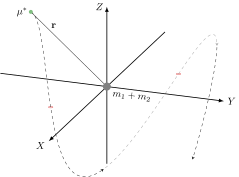

.. default-role:: math
.. sectionauthor:: Matt Werner
.. codeauthor:: Matt Werner

:sd_hide_title:

Simplifying the Equations
*************************

:Info: **Simplifying the Equations:** The Newtonian, Lagrangian, and Hamiltonian formalisms all provide the same
    system of equations for the motion of two particles under
    mutual Newtonian gravitational attraction with respect to the origin of an inertial
    coordinate system.

    .. math::
        :label: general2bp

        \ddot{\mathbf{r}}_1 &= -\frac{G m_2}{|\mathbf{r}_1 - \mathbf{r}_2|^3}(\mathbf{r}_1 - \mathbf{r}_2) \\
        \ddot{\mathbf{r}}_2 &= -\frac{G m_1}{|\mathbf{r}_2 - \mathbf{r}_1|^3}(\mathbf{r}_2 - \mathbf{r}_1)

    Amazingly, this system has a closed-form solution.
    Obtaining it, however, is made significantly easier once several properties are known.

:Description: Reframe the problem to half the amount of equations (`\mathbf{r}`) and parameters (`\mu`).
:Author: Matt Werner

Relative form
=============
To reduce the complexity of :eq:`general2bp` (as we will see), we can
define the **relative** distance between each body as

.. math::
    :label: relative

    \mathbf{r} = \mathbf{r}_2 - \mathbf{r}_1.

The equations of motion may be calculated directly from :eq:`general2bp` since

.. math::
    :label: eq:relativeEOM

    \ddot{\mathbf{r}} &= \ddot{\mathbf{r}}_2 - \ddot{\mathbf{r}}_1 \\
    &= -\frac{G(m_1 + m_2)}{r^3}\mathbf{r},

where `r = |\mathbf{r}|` is the distance between the two particles.

.. Important:: Doing this is beneficial because it exploits a symmetry in
    the full system of equations, essentially **halving** the number of
    equations to be solved in order to obtain *any* information.

The gravitational parameter
---------------------------
Equation :eq:`eq:relativeEOM` will actually be the one that we will use to analyze the 2-body problem.
As such, the quantity `G(m_1 + m_2)` will be appearing *a lot*, so it is convenient to define a new symbol.
This symbol is called the **gravitational parameter** and is denoted

.. math::
    :label: eq:gravitationalParameter

    \mu := G(m_1 + m_2).

This is convenient because we now only need to write one symbol, but more importantly, the motion only depends on **one** parameter --- the total mass `m_1 + m_2`, not necessarily what `m_1` and `m_2` are individually.

- **Example:** Suppose `\mu = 1`. The motion `\mathbf{r}` will be the **same** regardless whether `(Gm_1, Gm_2) = (0.5, 0.5)` or `(Gm_1, Gm_2) = (0.1, 0.9)` and so on.

Using the gravitational parameter, equation :eq:`eq:relativeEOM` is now written

.. math::
    :label: eq:standard_form

    \ddot{\mathbf{r}} = -\frac{\mu}{r^3}\mathbf{r}.

.. Important:: We have decreased the complexity of studying the equations of motion since they now depend on only a **single** parameter (`\mu`) as opposed to two (`Gm_1` and `Gm_2`).

..
    From a mathematical perspective, such a symbol is also convenient because it reduces the complexity of studying two parameters (`Gm_1` and `Gm_2`) to one.

Linear momentum
---------------
The two bodies are **isolated** --- that is, the center of mass satisfies

.. math:: \mathbf{r}_{cm}(t) = \mathbf{r}_{cm}(0) + \dot{\mathbf{r}}_{cm}(0) t,

since there is no external forcing to the system.
As such, the center of mass moves in a straight line (or not at all) in
accordance with Newton's 1\ :sup:`st` law. Further, we have **explicitly**
that

.. math::
    :label: positionsFromCenterOfMass

    \mathbf{r}_1 = \mathbf{r}_{cm} - \frac{m_2}{m_1 + m_2}\mathbf{r} \qquad \text{and} \qquad \mathbf{r}_2 = \mathbf{r}_{cm} + \frac{m_1}{m_1 + m_2}\mathbf{r}.

You can validate this for yourself!

.. admonition:: Hint
    :class: toggle

    For any `\mathbf{x}_1, \mathbf{x}_2 \in \mathbb{R}^3`, the center of mass for a
    system of two particles with respect to an inertial coordinate system is

    .. math::
        \mathbf{x}_{cm} := \frac{m_1 \mathbf{x}_1 + m_2 \mathbf{x}_2}{m_1 + m_2},

    where `m_1` and `m_2` are the masses of each body located
    (instantaneously) at `\mathbf{x}_1` and `\mathbf{x}_2`.

.. Important::
    :eq:`relative` provides **direct**
    information of both bodies (relative to each other) through
    :eq:`eq:relativeEOM` *and* enables the inertial positions of both bodies to
    be *calculated* from :eq:`positionsFromCenterOfMass` rather than directly
    solved from :eq:`general2bp`.

    This solidifies the idea that only half of the amount of equations
    have to be solved with :eq:`eq:relativeEOM`, but now *all* information about
    *both* bodies is known.

The reduced mass
================
The system :eq:`eq:relativeEOM` is writable as

.. math::
    \underbrace{\frac{m_1 m_2}{m_1 + m_2}}_{\mu^*}\ddot{\mathbf{r}} = \underbrace{-\frac{G m_1 m_2}{r^3}\mathbf{r}}_{-\nabla V},

which is in the form of Newton's 2\ :sup:`nd` law for a **single** particle of mass `\mu^*` being tracked in an inertial coordinate system with position `\mathbf{r}` under the influence of a potential `V`.
More clearly, we can write

.. math::
    \mu^* \ddot{\mathbf{r}} = -\frac{G(m_1 + m_2)\mu^*}{r^3}\mathbf{r}

**The 2-body system** :eq:`eq:relativeEOM` **can therefore be treated like it describes a single particle**\ [1]_.
The quantity `\mu^*` that makes this purely mathematical simplification possible is called the **reduced mass**.

    A "trajectory" of the reduced mass `\mu^*` in the presence of the potential `V`.

.. Important::
    **The trajectory of a single body of mass** `\mu^*` **under the influence of the potential from a static body of mass** `m_1 + m_2` **is the SAME trajectory experienced by the relative motion of two bodies under mutual Newtonian gravitational attraction!** This trajectory for both cases is `\mathbf{r}`.

Facts about the reduced mass system
-----------------------------------

**Fact:** `\mu^* < m_1 + m_2` for any `m_1, m_2 > 0`.

**Proof:** Suppose the opposite. Then `(m_1 + m_2)^2 = m_1^2 + 2m_1 m_2 + m_2^2 < m_1 m_2`,
but this means `0 < m_1^2 + m_2^2 < -m_1 m_2 < 0`, a contradiction. `\quad\square`

- This means that it's fair to imagine the smaller body simply flying around
  the larger body.

**Fact:** `\mu^* \to m_2` when `m_1 \gg m_2.`

**Proof:** Take `m_1 = k m_2` so that `\mu^*/m_2 = k/(k + 1)` and let `k \to \infty`. `\quad\square`

- This means that when the reduced mass is very small, then this system
  actually resembles the relative system. That is, `m_1` is nearly sitting
  at the origin and `m_2` is flying around it.

.. Important:: In our solar system, the gravitational parameter can be easily regarded as

    .. math::
        \mu \approx G m_1.

    This is the case where `m_2` represents spacecraft/moons/comets such that `m_1 \gg m_2.`

    **The effective statement of taking** `\mu` **this way is that the central body of mass** `m_1` **moves in a straight line (or not at all) relative to the inertial frame but the motion of the smaller body of mass** `m_2` **is still affected by the presence of the central body.**

.. Warning:: Do **not** confuse the 2-body gravitational parameter
    `\mu` with the 3-body mass parameter `\mu`.

    .. centered::
        **These quantities, though sharing the same symbol, are completely different**.

----------------------------------------------------------------------------

.. [1] :download:`The Two-Body Problem - UCSB Physics <http://web.physics.ucsb.edu/~fratus/phys103/LN/TBP.pdf>`